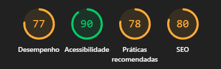
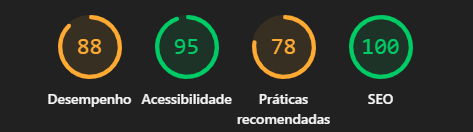

# Portal de Viagens AllTurismo

Projeto desenvolvido com Next.js com foco em otimização de performance web, acessibilidade, SEO e boas práticas modernas de front-end.

A aplicação apresenta destinos turísticos utilizando uma interface leve, responsiva e otimizada, aplicando técnicas reais de melhoria de desempenho analisadas através do Lighthouse do Google Chrome.

## Tecnologias Utilizadas
Next.js 16.1.1
React
TypeScript
CSS Modules
Next/Image
Lighthouse
AVIF Images

## Como Executar o Projeto:
1. Instalar as dependências: 
npm install

2. Rodar o projeto em ambiente de desenvolvimento: 
npm run dev

3. Abrir no navegador: 
http://localhost:3000

4. Gerar build de produção: 
npm run build

5. Executar build de produção: 
npm run start

## Gargalos Identificados
Durante a análise inicial com o Lighthouse foram encontrados alguns problemas comuns de performance:

Imagens não otimizadas
Necessidade de melhorar SEO
Melhorias possíveis de acessibilidade
Recursos visuais impactando carregamento
Necessidade de otimização da renderização

## Melhorias Aplicadas
- Otimização de Imagens
Conversão das imagens para formato .avif
Utilização do componente next/image
Configuração de sizes
Lazy loading automático

- Performance
Estrutura leve sem bibliotecas desnecessárias
Componentização da interface
CSS modularizado
Minificação automática do Next.js
Organização otimizada dos componentes
Redução de renderizações desnecessárias

- SEO
Metadata global
Metadata dinâmica nas páginas
Estrutura semântica correta
URLs amigáveis

- Acessibilidade
Uso de aria-label
Contraste adequado
Navegação semântica
Focus visible em links
Textos alternativos em imagens

## Comparativo Lighthouse
- Antes das otimizações

Comentários:
Imagens ainda não estavam totalmente otimizadas.
SEO possuía melhorias pendentes.
Acessibilidade apresentava pontos de melhoria.
O carregamento inicial estava mais pesado.

- Depois das otimizações

Comentários:
A otimização de imagens trouxe melhora significativa no carregamento.
O uso de AVIF reduziu o peso dos arquivos.
A utilização do next/image melhorou carregamento e renderização.
Melhorias semânticas aumentaram a pontuação de SEO e acessibilidade.
O projeto apresentou melhor estabilidade e experiência do usuário.

## Observação sobre “Práticas Recomendadas”
A pontuação reduzida na categoria “Práticas Recomendadas” ocorreu devido à execução local do projeto em ambiente HTTP (localhost), sem HTTPS configurado.

O Lighthouse considera requisitos avançados de segurança normalmente aplicados em ambientes de produção, como:

HTTPS
HSTS
CSP (Content Security Policy)
COOP
Proteções contra XSS e Clickjacking

Como o projeto foi executado localmente durante o desenvolvimento, esses recursos não estavam habilitados, impactando parcialmente a pontuação dessa categoria.

Apesar disso, o projeto apresentou excelente desempenho em performance, acessibilidade e SEO, além de não possuir erros no console, problemas de imagens ou falhas estruturais detectadas pelo Lighthouse.

## Relatórios
Os relatórios Lighthouse antes e depois da otimização estão disponíveis na pasta:

/relatorios

Arquivos incluídos:
antes.pdf
antes.png
depois.pdf
depois.png

## Responsividade
O projeto foi desenvolvido com foco em responsividade para:
Desktop
Tablet
Mobile

## Desenvolvido por:
Francisca Jacqueline Ribeiro Tavares

Estudante de Desenvolvimento Web
